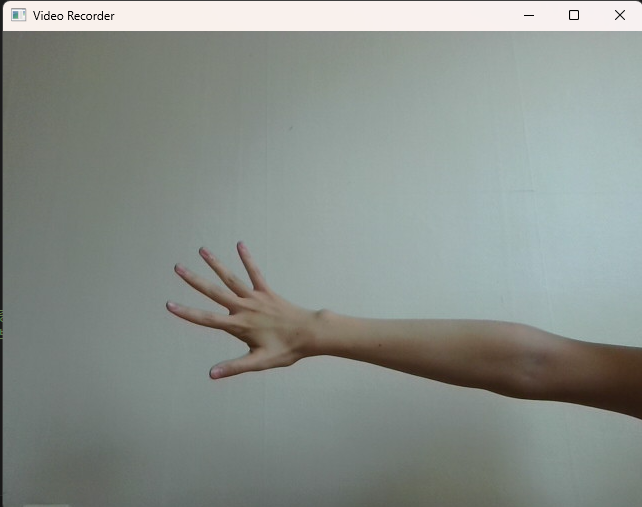
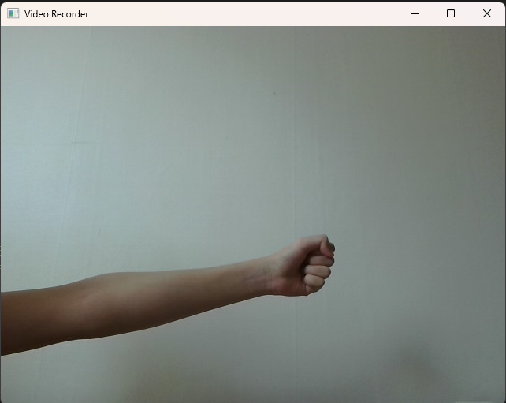
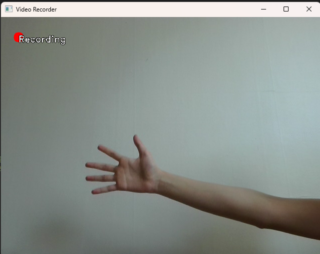
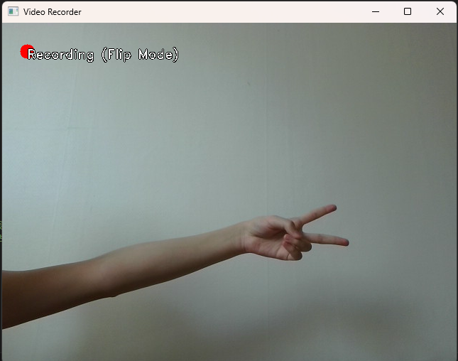

# OpenCV Video Recorder

## 기능 설명
이 프로그램은 OpenCV를 이용하여 웹캠 영상을 녹화하는 간단한 비디오 레코더입니다.

## 주요 기능
- **화면에 현재 카메라 영상 표시**
- **녹화 기능 지원**: `Space` 키를 눌러 녹화 시작/중지 가능
- **녹화 중 표시 기능**:
  - 녹화 중일 때 화면에 빨간 원과 "Recording" 텍스트 표시 (저장된 영상에는 표시되지 않음)
  - 좌우 반전 모드에서는 "Recording (Flip Mode)"로 표시
- **좌우 반전 기능**: `Tab` 키를 눌러 좌우 반전 모드 전환 가능
- **ESC 키로 프로그램 종료**

## 실행 방법

1. 필요한 라이브러리 설치:
   ```bash
   pip install opencv-python
   ```
2. `video_recorder.py` 실행:
   ```bash
   python video_recorder.py
   ```

## 스크린샷
녹화 및 반전 모드별 스크린샷:
- 일반 모드:


- 좌우 반전 모드:


- 녹화 모드:


- 녹화 + 좌우 반전 모드:



## 샘플 영상
- 일반 녹화 영상: [output.avi](./data/output.avi)
- 좌우 반전 녹화 영상: [output_fliped.avi](./data/output_fliped.avi)
